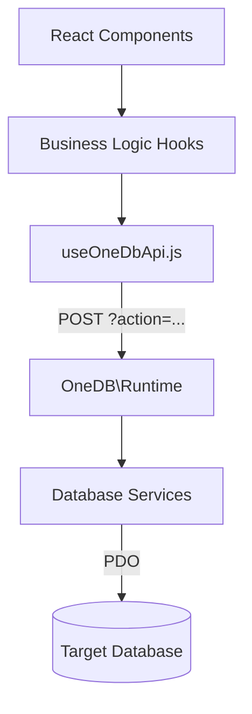

# OneDB System Map

This map describes the orchestration and data flow between the various components of the OneDB project.

## 🏗️ Technical Architecture

### 1. Orchestration Layer
The backend is built around a single dispatcher: `OneDB\Runtime`.

- **Entry Point**: `backend/bootstrap.php` initializes the environment and calls `OneDB\Runtime::dispatch()`.
- **Dispatcher**: `backend/src/runtime.php` resolves the `action` parameter and routes it to specific services.
- **Service Layers**:
    - `MetadataService`: Handles schema introspection (databases, tables, columns).
    - `QueryService`: Executes SQL queries and transactions.
    - `ConnectionFactory`: Manages PDO connections for MySQL/PostgreSQL/SQLite.

### 2. Frontend-Backend Data Flow

The frontend communicates with the backend via JSON-RPC-style actions.

### 3. Build & Release Pipeline
OneDB uses a custom packing mechanism to generate a single-file release.

1.  **Vite Build**: Compiles frontend assets into `frontend/dist/`.
2.  **Pack Script**: `build/pack-release.mjs` reads the compiled JS/CSS and injects them into a PHP template.
3.  **Output**: `release/OneDB.php` contains the entire application (Backend + Frontend + Assets).

## 🛡️ Security Mechanisms
- **CSRF Protection**: Handled by `OneDB\Http\SessionCsrf`. Every `POST` request must include a `one-db-csrf` header.
- **ReadOnly Guard**: `OneDB\Database\ReadOnlySqlGuard` prevents destructive queries when `ONEDB_READONLY` is enabled.

## 📁 Key Directories
| Path | Purpose |
| :--- | :--- |
| `backend/src/` | Core PHP logic and services. |
| `frontend/src/` | React source, components, and hooks. |
| `ai/docs/` | Comprehensive human-readable documentation. |
| `build/` | Tooling for minification and release packing. |
